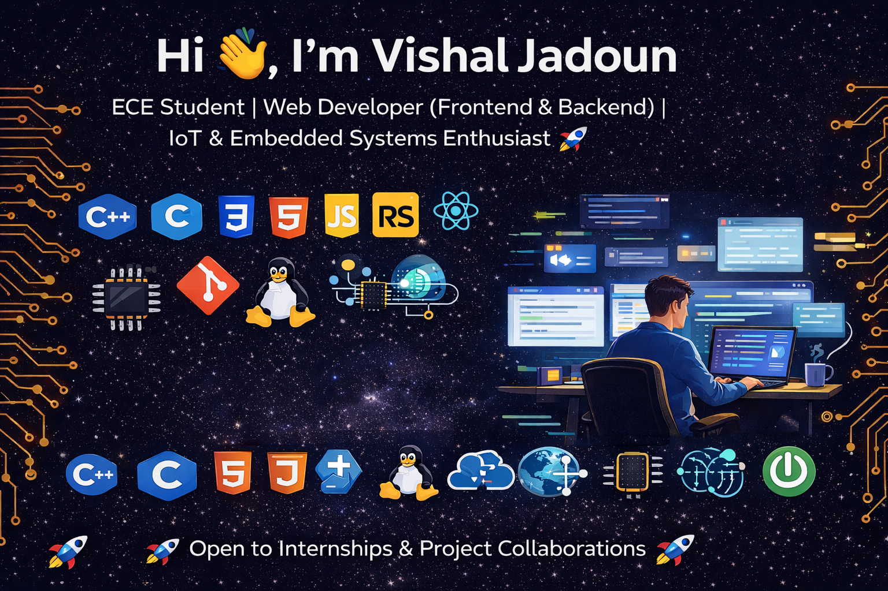

<h1 align="center">Hi 👋, I'm Vishal Jadoun</h1>

<h3 align="center">
  ECE Student | Web Developer (Frontend & Backend) | IoT & Embedded Systems Enthusiast 🚀
</h3>

  

- 🌱 <b>Currently learning & exploring</b>:  
  Full-Stack Web Development (MERN & Spring Boot basics), Cloud Fundamentals,  
  IoT System Design, Embedded C & Microcontrollers, DevOps Basics

- 💬 <b>Ask me about</b>:  
  Frontend Development (HTML, CSS, JavaScript, React),  
  Backend Concepts, IoT Projects with Arduino, Embedded Systems Basics,  
  Git & GitHub, Project Building for Students

- 📫 <b>Reach me</b>:  
  📧 jadounvishal16@gmail.com  

- ⚡ <b>Fun fact</b>:  
  I enjoy debugging hardware errors as much as fixing frontend bugs 😄

<h3 align="left">Connect with me:</h3>

<h3 align="left">Languages and Tools:</h3>

  
  
  
  
  
  
  
  
  
  

  

  <h3>🚀 Open to Internships & Project Collaborations 🚀</h3>

